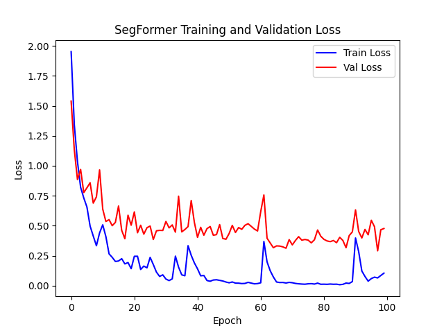
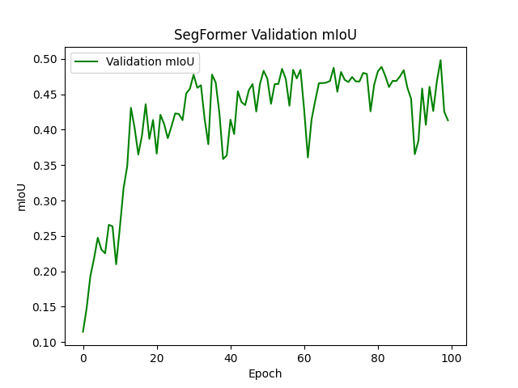
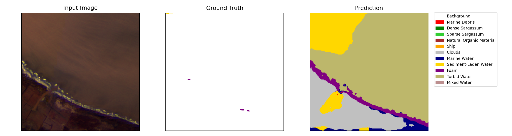
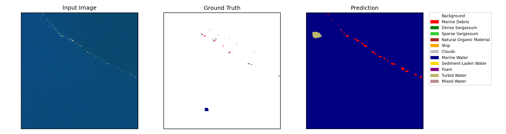
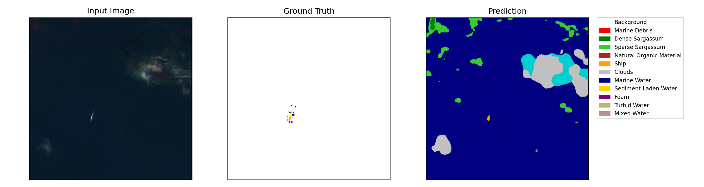

# Benchmarking Attention-Driven Deep Networks for Marine Debris Segmentation in Sentinel-2 Imagery

This repository provides a modular and scalable deep learning pipeline for semantic segmentation of marine debris and oceanographic features from Sentinel-2 satellite data. It benchmarks three powerful models — **UNet_CBAM**, **UNetPlusPlus_CBAM**, and **SegFormer** — on the **MARIDA** dataset.

The selected architectures incorporate **attention mechanisms** (e.g., CBAM and Transformers) to enhance feature learning and spatial understanding, especially in cluttered ocean scenes. The goal is to improve detection of complex sea surface phenomena including marine debris, Sargassum, ship wakes, foam, and more.

The pipeline includes:
- Custom PyTorch datasets and loaders tailored for MARIDA
- Attention-enhanced CNNs (CBAM) and Transformer-based segmentation
- Class-weighted loss for handling class imbalance
- Automated scripts for training, inference, evaluation, and visualization
- Training diagnostics via loss and mean IoU (mIoU) plots


## Table of Contents

- [Dataset](#dataset)
- [Installation & Setup](#installation--setup)
- [Training & Evaluation](#training--evaluation)
- [Results & Performance](#results--performance)
- [Citation](#citation)
- [Acknowledgements](#acknowledgements)


## Dataset

This project uses the **Marine Debris Archive (MARIDA)** — a weakly-supervised pixel-level semantic segmentation benchmark derived from Sentinel-2 satellite imagery. It is designed to detect marine debris and associated sea surface phenomena like **Sargassum**, **organic matter**, **ships**, **cloud shadows**, and **waves**.


#### Download

## Dataset

This project uses the **Marine Debris Archive (MARIDA)** — a weakly-supervised pixel-level semantic segmentation benchmark derived from Sentinel-2 satellite imagery. It is designed to detect marine debris and associated sea surface phenomena like **Sargassum**, **organic matter**, **ships**, **cloud shadows**, and **waves**.

### Download

You can either:

- Automatically download the best-trained models and required dataset subset (for prediction, evaluation, and visualization) using:

  ```bash
  python scripts/models_and_data.py
  ```

- Or manually download the full MARIDA dataset from [Radiant MLHub](https://mlhub.earth/data/marida), and extract it under the `data/` directory:

```bash
marine-debris-segmentation/
└── data/
    ├── patches/                  # Contains image patches and masks
    │   ├── S2_12-12-20_16PCC_6.tif
    │   ├── S2_12-12-20_16PCC_6_cl.tif      # Ground truth mask
    │   └── S2_12-12-20_16PCC_6_conf.tif    # Confidence mask (optional)
    ├── splits/
    │   ├── train_X.txt
    │   ├── val_X.txt
    │   └── test_X.txt
    └── labels_mapping.txt        # (optional - used for multi-label classification)
```

#### Label Classes

The classification masks (`*_cl.tif`) include the following class IDs:

| ID  | Class Name               |
|-----|---------------------------|
| 0   | Background                |
| 1   | Marine Debris             |
| 2   | Dense Sargassum           |
| 3   | Sparse Sargassum          |
| 4   | Natural Organic Material  |
| 5   | Ship                      |
| 6   | Clouds                    |
| 7   | Marine Water              |
| 8   | Sediment-Laden Water      |
| 9   | Foam                      |
| 10  | Turbid Water              |
| 11  | Shallow Water             |
| 12  | Waves                     |
| 13  | Cloud Shadows             |
| 14  | Wakes                     |
| 15  | Mixed Water               |

> *Class `0` (Background) and the optional `*_conf.tif` confidence maps are not used for training, but are helpful for filtering or visualization.*


#### Citation

> R. Veit et al., “MARIDA: A Benchmark for Marine Debris Detection in Sentinel-2 Satellite Imagery,” *IGARSS 2022*.  
> DOI: [10.1109/IGARSS46834.2022.9884340](https://doi.org/10.1109/IGARSS46834.2022.9884340)

## Installation & Setup

This project uses **Python 3.9+** and is managed via **conda**. All dependencies are defined in the `environment.yml` file.

#### Clone the Repository

```bash
git clone https://github.com/venkataramaraoguttikonda/marine-debris-segmentation.git
cd marine-debris-segmentation
```

#### Create the Environment

```bash
conda env create -f environment.yml
conda activate marinedebri
```

This installs PyTorch, Hugging Face Transformers, rasterio, matplotlib, and other required packages.

#### Initial Folder Structure

After cloning and setting up, your project should look like this:

```bash
marine-debris-segmentation/
├── src/
│   ├── train/
│   ├── inference/
│   ├── evaluate/
│   ├── models/
│   ├── dataset/
│   └── visualization/
├── scripts/
├── data/
│   ├── patches/
│   └── splits/
├── environment.yml
└── README.md
```

> Additional folders like `trained_models/`, `predictions_*/`, `vis_outputs/`, and `plots/` are **automatically generated** during training, inference, and visualization steps.


## Training & Evaluation

This repository supports training and evaluation of three segmentation models: **UNet_CBAM**, **UNetPlusPlus_CBAM**, and **SegFormer**.


####  Training model from scratch

Each model has a dedicated shell script under `scripts/` for running the full pipeline:

```bash
# Train, predict, evaluate and visualize for UNet
chmod +x scripts/run_unet.sh
./scripts/run_unet.sh

# UNet++ (UNetPlusPlus_CBAM)
chmod +x scripts/run_unetpp.sh
./scripts/run_unetpp.sh

# SegFormer
chmod +x scripts/run_segformer.sh
./scripts/run_segformer.sh
```


## Inference and Evaluation Using Pretrained Models

To run inference, evaluation, and visualization with the pretrained models and required dataset:

#### Download Data and Trained Models

```bash
python scripts/models_and_data.py
```

This script will:

- Download the best-performing `.pth` model checkpoints into the `trained_models/` directory
- Download and extract the required subset of the MARIDA dataset into the `data/` directory

#### Run Inference and Evaluation

```bash
# UNet
python src/main_unet.py --model unet --predict --evaluate --visualize

# UNet++ (UNetPlusPlus_CBAM)
python src/main_unet.py --model unet++ --predict --evaluate --visualize

# SegFormer
python src/main_segformer.py --predict --evaluate --visualize
```

The scripts will automatically use the test data included in the downloaded `data/` folder.

These commands use the **test split only**, which is included in the repository under `data/splits/test_X.txt`.

**Note:** Outputs will be saved under:

- `predictions_unet/`, `predictions_unetpp/`, `predictions_segformer/`
- `vis_outputs/unet/`, `vis_outputs/unetpp/`, `vis_outputs/segformer/`
- `plots/` for training loss/mIoU curves (if training is run)


## Results & Performance

This section summarizes both quantitative metrics and qualitative outputs for all models: **UNet_CBAM**, **UNetPlusPlus_CBAM**, and **SegFormer**.

#### Quantitative Evaluation (on Test Set)

The following metrics are reported: **Pixel Accuracy**, **Mean IoU**, and **Macro F1 Score**.

| Model              | Pixel Accuracy | Mean IoU | Macro F1 Score |
|--------------------|----------------|----------|----------------|
| UNet_CBAM          | 0.9190         | 0.5388   | 0.6543         |
| UNetPlusPlus_CBAM  | 0.9224         | 0.6014   | 0.7061         |
| SegFormer          | **0.9737**     | **0.7309** | **0.8234**          |

> *SegFormer achieved the highest overall performance in terms of accuracy and mIoU.*

#### Training Loss and mIoU Curves

Below are the combined training and validation loss, and mIoU plots for **SegFormer** (best-performing model):

<p align="center">
  
  
</p>

---

#### Visual Results (SegFormer Predictions)

Below are example qualitative results (Input → Ground Truth → Prediction) from the SegFormer model:

<p align="center">
  
</p>

<p align="center">
  
</p>

<p align="center">
  
</p>


## Citation

If you use this repository or any part of it in your research or project, please cite:

- **MARIDA Dataset:**  
  R. Veit et al., “MARIDA: A Benchmark for Marine Debris Detection in Sentinel-2 Satellite Imagery,” *IGARSS 2022*.  
  DOI: [10.1109/IGARSS46834.2022.9884340](https://doi.org/10.1109/IGARSS46834.2022.9884340)

- **SegFormer Model:**  
  E. Xie et al., “SegFormer: Simple and Efficient Design for Semantic Segmentation with Transformers,” *NeurIPS 2021*.  
  [https://arxiv.org/abs/2105.15203](https://arxiv.org/abs/2105.15203)

- **Hugging Face Transformers:**  
  [https://github.com/huggingface/transformers](https://github.com/huggingface/transformers)

- **PyTorch:**  
  [https://pytorch.org/](https://pytorch.org/)


## Acknowledgements

This work was developed as part of the **Deep Learning for Computer Vision (DS265)** course at the **Indian Institute of Science (IISc), Bengaluru**.

**Course Instructor:** Prof. R. Venkatesh Babu

**Contributors:**
- Venkata Ramarao Guttikonda (M.Tech – CAOS, IISc)
- Ananya Krishna Devupalli (M.Tech – CAOS, IISc)

Special thanks to:
- **MARIDA Dataset** by R. Veit et al.
- The developers of **PyTorch**, **Hugging Face Transformers**, and other open-source tools used in this project